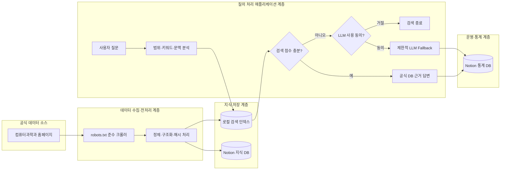

# ComPass

**ComPass = Computer Science X Compass(나침반)**

한국방송통신대학교 컴퓨터과학과 학생들의 길잡이가 되는 공식 정보 RAG 챗봇입니다. 홈페이지 공개 정보를 수집해 Notion 지식 DB에 적재하고 공식 데이터 검색을 우선합니다.

ComPass는 단순 검색 결과 제공 챗봇이 아닙니다. 공식 데이터를 학생이 이해하기 쉬운 형태로 재해석하여 안내하는 AI 학과 비서입니다.

모든 응답은 공식 데이터 우선, 원문 전체 출력 금지, 핵심 요약 우선, 최대 3개 먼저 표시, 더보기 제공, 개별·전체 바로가기 제공, 모바일 가독성 우선 원칙을 따릅니다.

질문은 답변 전에 `smalltalk`, `faculty`, `curriculum`, `course_detail`, `course_recommendation`, `notice_list`, `schedule_list`, `faq`, `certification`, `graduation`, `out_of_scope` 의도로 분류합니다. 결정된 의도와 관련된 공식 데이터만 선별하며, 서로 다른 문서 유형을 한 답변에 섞지 않습니다.

과목 상세 질문은 교수진이나 공지사항을 함께 출력하지 않고, 과목 개요·쉬운 설명·주요 학습 내용·추천 대상·공식 바로가기로 재구성합니다.

검색 인덱스를 만들 때 `course_catalog`도 함께 생성합니다. 과목명, 공백 제거 별칭, 주요 약칭, Notion 문서 ID, 공식 URL, 문서유형을 저장하며 질문에서 가장 긴 과목명 또는 별칭을 우선 감지합니다.

교과목 질문 우선순위는 `course_difficulty > course_detail > course_recommendation > curriculum > notice`입니다. 특정 과목명이 감지되면 `과목상세`, `교과목목록`, `교육과정표`, `검증지식`만 검색하고 교수진·공지·게시판·일정 문서는 제외합니다.

수업 난이도, 공부량, 공부 방법, 선수지식처럼 공식 데이터에 없는 학습 조언은 즉시 단정하지 않습니다. 공식 과목 개요를 먼저 확인한 후 사용자가 동의하면 제한적 LLM 보조 답변을 생성하며, 체감 난이도가 참고용이고 개인 경험에 따라 달라진다는 점을 명시합니다. 공식 학점·개설 학기·시험 범위·평가 방식은 추측하지 않습니다.

## 주요 기능

- `https://cs.knou.ac.kr/sites/cs1/index.do`에서 시작하는 내부 링크 BFS 크롤링
- `https://c-knou.com/computer_science` 최근 공개 글을 비공식 보조 지식으로 별도 수집
- 공식/비공식 출처를 Notion과 검색 인덱스에서 분리하고 기본 챗봇 답변은 공식 문서만 검색
- `cs.knou.ac.kr/sites/cs1` 하위 공개 HTML만 수집
- robots.txt 준수, 요청 간 delay, 중복 URL 제거, 로그인·외부 링크 제외
- 제목, 카테고리, 본문, 요약, 원본 URL, 게시일, 수집일, 키워드, 첨부파일 구조화
- HTML 표를 `table_headers`, `table_rows`, `normalized_items`로 분리해 원문 표 노출 방지
- URL 기준 Notion upsert 및 콘텐츠 해시 기반 `신규/변경/유지` 판정
- 콘텐츠 해시가 같은 문서는 Notion API 쓰기를 수행하지 않는 완전 증분 동기화
- 메뉴·푸터·스크립트 설정값을 제거하고 메인/일반페이지/게시판목록/게시물 표준 형식으로 저장
- 교수진 공식 페이지(`/cs1/4786/subview.do`)는 선택한 Depth와 관계없이 필수 수집
- 교수진 페이지의 `professor.knou.ac.kr` 링크, `onclick` URL, 이메일 기반 slug를 분석해 교수별 `homepage_url`을 구조화
- 교육과정 공식 페이지(`/cs1/4789/subview.do`)도 필수 수집하고 과목 카드 데이터로 정규화
- 교과목 안내(`/cs1/4791/subview.do`)의 `jf_detailView` POST 팝업을 과목별로 필수 수집해 `과목상세` 문서로 저장
- 교수진 질문은 교수진 공식 문서만 사용하도록 전용 검색 가중치와 답변 형식 적용
- 졸업학점·추천 자격증·시험범위는 `의도/과목/시험종류/유효기준` 구조화 지식으로 정확 매칭
- 명시적 현재 질문을 이전 대화보다 우선하여 후속 질문 문맥 충돌 방지
- 유사어 확장, 키워드 빈도, 제목·카테고리 가중치, 부분 일치 기반 로컬 검색
- Notion 공식 데이터 검색 결과 우선 답변
- 검색 점수가 낮을 때 사용자 확인 후 OpenAI 또는 Gemini 보조 호출
- 이전 질문을 이용한 짧은 후속 질문 문맥 보완
- 모든 질문·응답을 Notion 통계 DB에 비동기 기록
- 크롤링, 인덱스, 검색 테스트, 질문 통계를 포함한 한국어 관리자 UI
- Depth 0~5 수동 크롤링 범위 선택과 실시간 방문·대기·수집 현황 프로그래스바
- 크롤링 진행률은 크롤링 0~80%, Notion 저장 80~100%로 분리하고 `/api/crawl/status`에서 저장/실패/유지 건수와 현재 문서명을 확인
- Render 콜드 스타트 안내 화면 및 모바일 반응형 UI
- 빈 화면 우측 하단 플로팅 아이콘, 채팅 창 모드, 전체 화면 전환
- `static/icons/`의 ComPass 공식 PNG 아이콘을 플로팅 버튼, 헤더, 환영 메시지, favicon, PWA, 로딩 화면, 검색 중 애니메이션에 공통 적용
- 모바일은 플로팅 버튼 선택 시 즉시 전체화면, 데스크톱은 기존 PIP 창 유지
- 목록형 답변은 3개 우선 표시 후 더보기/접기와 공식 페이지 바로가기 제공
- 교수진 답변은 교수명·직위·이메일·연락처·대표 담당과목을 카드로 표시하고, 교수 홈페이지가 있으면 개별 바로가기 버튼을 제공합니다.
- 특정 교수명 질문은 `faculty_detail`로 분류해 해당 교수 1명만 표시하며, 전체 교수진 목록을 섞지 않습니다.
- 최근 공지는 제목·게시일·80자 이내 요약만 카드로 표시하며 글번호·첨부 설명·본문 전문은 노출하지 않음
- 학과 일정은 달력 원문 대신 시작일·종료일·일정명으로 구조화하고 다가오는 일정부터 표시
- 검색 중에는 타이핑 및 점 애니메이션이 적용된 로딩 카드를 표시
- 짧은 대화는 메시지 하단에 자연스럽게 정렬하고, 입력 영역 높이 변화는 `ResizeObserver`로 보정

## 프로젝트 구조

```text
.
├── main.py                 # FastAPI 앱과 API
├── config.py               # 환경변수 및 공통 설정
├── crawler.py              # 홈페이지 크롤러
├── notion_client.py        # Notion 조회/upsert 클라이언트
├── search_index.py         # 로컬 검색 인덱스
├── chatbot.py              # 범위 제한, DB 우선 답변, LLM fallback
├── stats.py                # Notion 질문 통계 저장/조회
├── templates/index.html    # 단일 관리자/챗봇 화면
├── static/style.css
├── static/app.js
├── data/                   # 크롤링 스냅샷과 검색 인덱스
├── requirements.txt
├── .env.example
└── render.yaml
```

## 처리 흐름



## 로컬 실행

Python 3.11 이상을 권장합니다.

```bash
python3 -m venv .venv
source .venv/bin/activate
pip install -r requirements.txt
cp .env.example .env
```

`.env`에 Notion 토큰, DB ID, 관리자 비밀번호, 사용할 LLM API 키를 입력합니다.

```bash
uvicorn main:app --reload --host 127.0.0.1 --port 8000
```

브라우저에서 `http://127.0.0.1:8000`을 엽니다. 최초 실행 순서는 다음과 같습니다.

1. `관리자 페이지`를 눌러 관리자 비밀번호로 로그인합니다.
2. 로그인 후 표시되는 `크롤링 관리`에서 `DB 테이블 구성`을 눌러 빈 Notion DB에 필수 컬럼을 자동 생성합니다.
3. `수동 크롤링 실행`으로 홈페이지를 수집하고 Notion에 적재합니다.
4. `검색 인덱스`에서 `인덱스 재생성`을 실행합니다.
5. 검색 테스트 후 챗봇 탭에서 질문합니다.

## 환경변수

| 변수 | 설명 |
|---|---|
| `NOTION_TOKEN` | Notion Internal Integration Secret |
| `NOTION_KNOWLEDGE_DB_ID` | 크롤링 지식 DB ID |
| `NOTION_STATS_DB_ID` | 질문 통계 DB ID |
| `LLM_PROVIDER` | `openai` 또는 `gemini` |
| `OPENAI_API_KEY` | OpenAI 사용 시 API 키 |
| `OPENAI_MODEL` | OpenAI 모델명 |
| `GEMINI_API_KEY` | Gemini 사용 시 API 키 |
| `GEMINI_MODEL` | Gemini 모델명 |
| `CRAWL_START_URL` | 크롤링 시작 URL |
| `ALLOWED_DOMAIN` | 허용 호스트 |
| `ALLOWED_PATH_PREFIX` | 허용 URL 경로 접두사. 쉼표로 복수 지정 가능 |
| `CRAWL_DELAY_SECONDS` | 요청 사이 대기 시간 |
| `CRAWL_MAX_PAGES` | 한 번에 방문할 최대 URL 수 |
| `COMMUNITY_CRAWL_ENABLED` | c-knou 비공식 커뮤니티 보조 수집 활성화 여부 |
| `COMMUNITY_START_URL` | 커뮤니티 공개 게시판 시작 URL |
| `COMMUNITY_ALLOWED_DOMAIN` | 커뮤니티 수집 허용 호스트 |
| `COMMUNITY_LIST_PAGES` | 최근 목록을 확인할 페이지 수. 기본값 5 |
| `COMMUNITY_MAX_DOCUMENTS` | 한 번에 수집할 게시물 최대 수. 기본값 100 |
| `COMMUNITY_DELAY_SECONDS` | 커뮤니티 요청 사이 대기 시간. 기본값 1.5초 |
| `ADMIN_PASSWORD` | 관리자 API 비밀번호 |
| `SEARCH_MIN_SCORE` | DB 답변으로 인정할 최소 검색 점수 |

토큰과 키는 코드에 넣지 말고 `.env` 또는 배포 서비스의 Secret 환경변수로만 관리합니다.

이전 배포 환경과의 호환을 위해 `NOTION_API_KEY`는 `NOTION_TOKEN`의 별칭으로, `NOTION_DATABASE_ID`는 `NOTION_KNOWLEDGE_DB_ID`의 별칭으로 인식합니다. 신규 설정은 표의 공식 변수명을 사용하십시오.

## Notion 연동 준비

1. Notion에서 Internal Integration을 생성합니다.
2. 지식 DB와 통계 DB 각각의 연결 메뉴에서 해당 Integration을 초대합니다.
3. `.env`에 Integration Secret과 DB ID를 입력합니다.
4. 아래 표와 **동일한 컬럼명 및 타입**으로 DB를 구성합니다.

### 지식 DB 컬럼

| 컬럼명 | Notion 타입 | 비고 |
|---|---|---|
| 제목 | Title | 필수 |
| 문서유형 | Select | 메인 / 일반페이지 / 게시판목록 / 게시물 |
| 카테고리 | Select | |
| 본문 | Rich text | 검색용 본문 앞부분, 전체 본문은 페이지 블록에도 저장 |
| 요약 | Rich text | |
| 원본URL | URL | 중복 판정 키 |
| 게시일 | Date | |
| 수집일 | Date | |
| 키워드 | Multi-select | |
| 콘텐츠해시 | Rich text | 변경 판정 |
| 상태 | Select | 신규 / 변경 / 유지 |
| 검색용텍스트 | Rich text | 제목·카테고리·요약·키워드·본문 결합 |
| 첨부파일 | Rich text | 첨부파일 URL 목록 |
| 본문길이 | Number | 정제된 본문의 글자 수 |
| table_headers | Rich text | HTML 표의 병합된 열 제목 JSON |
| table_rows | Rich text | HTML 표의 원본 행 배열 JSON |
| normalized_items | Rich text | 과목명·학년·학기·코드·강의매체·평가방법 JSON |

### 통계 DB 컬럼

| 컬럼명 | Notion 타입 |
|---|---|
| 사용자질문 | Title |
| 질문일시 | Date |
| 추출키워드 | Multi-select |
| 검색결과유무 | Checkbox |
| 응답방식 | Select |
| 답변내용 | Rich text |
| 참조URL | Rich text |
| 응답시간 | Number |
| 검색점수 | Number |
| 실패사유 | Rich text |

Notion DB 링크에서 32자리 ID를 가져와 환경변수에 입력합니다. 제공된 기본 ID는 다음과 같습니다.

- 지식 DB: `38773fbd195180788faac9a54ae8e512`
- 통계 DB: `38773fbd195180708158dc38ec3fbd2f`

## API

| Method | Path | 설명 |
|---|---|---|
| GET | `/` | 메인 HTML |
| POST | `/api/admin/login` | 관리자 비밀번호 검증 |
| POST | `/api/crawl` | `max_depth`를 지정한 수동 크롤링 및 Notion 적재 |
| GET | `/api/crawl/status` | 크롤링 작업 상태 |
| POST | `/api/notion/setup` | 두 Notion DB의 필수 컬럼 자동 구성 |
| POST | `/api/index/rebuild` | Notion 기반 검색 인덱스 재생성 |
| GET | `/api/index/status` | 인덱스 상태 |
| POST | `/api/search/test` | 관리자 검색 테스트 |
| POST | `/api/chat` | DB 검색 우선 질문 처리 |
| GET | `/api/stats` | 최근 질문 통계 |
| GET | `/api/knowledge/recent` | 최근 지식 데이터 |
| GET | `/api/health` | 서버 상태 |
| GET | `/api/debug/index-status` | Notion 연결, 로딩 문서 수, 인덱스 수, 동기화 시각, 마스킹 DB ID |

관리자 API에는 `X-Admin-Password` 헤더가 필요합니다. 관리자 탭에서
`POST /api/admin/login` 인증에 성공하면 현재 페이지가 유지되는 동안만 비밀번호를
메모리에 보관합니다. 새로고침하면 다시 인증해야 하며, `ADMIN_PASSWORD`가 비어 있으면
모든 관리자 접근은 기본 차단됩니다.

관리자 화면의 수집일, 질문일시, 인덱스 생성 시각 등은 DB의 UTC 원본을 변경하지 않고
브라우저에서 `Asia/Seoul` 기준 `YYYY-MM-DD HH:mm KST` 형식으로 표시합니다.

### 챗봇 요청 예시

```json
{
  "question": "컴퓨터과학과 교육과정을 알려줘",
  "history": [],
  "allow_llm": false
}
```

검색 결과가 부족하면 `requires_llm_confirmation: true`가 반환됩니다. 사용자가 동의한 경우 동일 질문을 `allow_llm: true`로 다시 요청합니다.

서버 시작 시 Notion 지식 DB를 자동 로딩해 검색 인덱스를 생성합니다. 첫 질문 시 인덱스가 비어 있으면 lazy loading을 다시 시도하며, 실패 원인은 Render 로그의 `[INDEX]` 및 `[CHAT]` 항목과 `/api/debug/index-status`에서 확인할 수 있습니다.

### 깊이별 크롤링

```json
{
  "max_depth": 3
}
```

- Depth 0: 시작 페이지
- Depth 1: 주요 메뉴
- Depth 2: 하위 메뉴와 게시판 목록
- Depth 3: 게시물 상세 페이지까지 권장 탐색
- Depth 5: 확장 탐색

Depth 1 이상에서는 공식 사이트 수집 후 c-knou 컴퓨터과학과 게시판의 최근 공개
글도 보조 지식으로 수집합니다. 이 자료는 학교 공식 정보가 아니므로 Notion의
`출처구분=비공식 커뮤니티`로 저장되고 일반 질문의 공식 답변 근거에서는 자동
제외됩니다. 작성자, 댓글, 회원정보, 첨부파일은 저장하지 않으며 원문 대신 최대
800자의 요약과 원본 URL만 보관합니다.

## 답변 안전 정책

- 한국방송통신대학교 컴퓨터과학과 공식 정보만 답변합니다.
- 일반 잡담, 타 학교, 타 학과, 개인 상담, 코딩 대행은 거절합니다.
- DB 검색 결과가 있으면 LLM을 호출하지 않습니다.
- 공식 데이터에서 확인되지 않는 내용은 추측하지 않습니다.
- LLM은 공식 정보 범위 안의 질문이며 DB 근거가 부족하고 사용자가 동의한 경우에만 호출합니다.
- 확인되지 않는 경우 다음 문구를 반환합니다.

### 구조화 지식 관리

짧고 정확한 단답이 필요한 정보는 [`data/curated_knowledge.json`](data/curated_knowledge.json)에서 관리합니다. 서버 시작과 DB 테이블 구성, 크롤링 실행 시 Notion 지식 DB에도 자동 동기화됩니다.

- `intent`: 질문 의도
- `subject`: 과목명
- `assessment`: 시험 종류
- `match_all`, `match_any`: 정확 매칭 조건
- `answer`: 검증된 답변
- `validity`: 적용 학기 또는 유효 기준
- `source_url`: 확인 출처
- `answer_type`: 카드 렌더링 유형
- `recommendation_groups`: 추천 유형별 과목·이유·난이도·학습 부담

`transfer_student_course_recommendation` 의도는 `3학점`, `편입생`, `쉬운 과목`,
`직장인 추천`, `입문 과목` 등의 자연어를 일반 게시판 검색보다 먼저 처리합니다.
추천 결과는 공식 교육과정 확인 안내와 함께 3개만 우선 표시합니다.

### 모바일 UI와 구조화 답변

- 모바일 판정: 화면 너비 768px 이하, coarse pointer, 모바일 User-Agent
- 모바일에서는 PIP 대신 `100vw × 100dvh` 전체화면을 사용합니다.
- iOS 키보드 환경은 `visualViewport.height`를 `--app-height`에 반영합니다.
- 키보드가 열리면 하단 탭과 빠른 메뉴를 숨기고 입력창을 보이는 영역에 유지합니다.
- 입력창 focus 시 강제 `scrollIntoView()`를 실행하지 않아 모바일 화면 점프를 방지합니다.
- iOS Safari 자동 확대 방지를 위해 입력창 글자 크기는 `16px` 이상으로 유지합니다.
- composer는 `position: sticky`와 `safe-area-inset-bottom`을 사용해 키보드 위에 유지합니다.
- 입력창 문구: `궁금한 컴퓨터과학과 정보를 질문해보세요`
- `faculty`, `course_table`, `notice_list`, `schedule_list`, `faq_list`,
  `course_recommendation`은 카드형 요약과 `actions` 버튼으로 렌더링합니다.
- PIP/모바일의 교육과정 표는 `overflow-x:auto`와 최소 너비를 사용해 긴 특징 문구가 잘리지 않도록 좌우 스크롤로 확인합니다.

### 관리자 메뉴 접근 정책

- 비로그인 상태의 상단 메뉴는 `챗봇`, `관리자 페이지`만 표시합니다.
- `크롤링 관리`, `검색 인덱스`, `질문 통계` 메뉴와 관리자 패널은 인증 전 숨김 처리합니다.
- `관리자 페이지`를 누르면 관리자 로그인 모달을 표시합니다.
- 로그인 성공 후에만 관리자 메뉴 3개를 노출하고 기본 탭은 `크롤링 관리`로 이동합니다.
- 로그아웃하면 관리자 메뉴를 다시 숨기고 챗봇 탭으로 복귀합니다.
- 관리자 API는 기존처럼 `X-Admin-Password` 헤더와 `ADMIN_PASSWORD` 환경변수로 서버에서 검증합니다.

### 크롤링/Notion 저장 상태 관리

- 백그라운드 크롤링 작업은 전체 `try/except/finally`로 감싸며 실패해도 `running=false`로 종료합니다.
- Notion 저장은 문서별로 진행 로그를 남기고, 특정 문서 실패 시 `failed_count`만 증가시킨 뒤 다음 문서 저장을 계속합니다.
- Notion API 요청은 15초 timeout을 사용하고 429/5xx 응답은 `Retry-After` 또는 1~3초 대기 후 최대 3회 재시도합니다.
- `/api/crawl/status`는 `saved_count`, `failed_count`, `skipped_count`, `current_title`, `error`, `updated_at`을 반환합니다.
- 프론트는 `updated_at`이 2분 이상 갱신되지 않으면 “작업 응답 없음. 서버 로그 확인 필요”를 표시합니다.

### ComPass 아이콘/PWA

- 원본 아이콘: `static/icons/icon.png`
- favicon: `static/icons/favicon.ico`, `favicon-16x16.png`, `favicon-32x32.png`
- 모바일 홈 화면: `static/icons/apple-touch-icon.png`
- PWA 아이콘: `static/icons/icon-192.png`, `static/icons/icon-512.png`
- Web App Manifest: `static/manifest.json`

### LLM fallback 품질 규칙

LLM은 공식 DB 검색 결과가 충분하지 않고 사용자가 보조 답변을 허용한 경우에만 호출합니다.
LLM 답변도 검색 결과를 그대로 붙여 넣지 않고 학생이 이해하기 쉬운 형태로 재구성합니다.

- 제목 → 1~2줄 설명 → 표/목록 → 참고 안내 → 바로가기 순서로 정리합니다.
- 문장 중간 끊김, 키워드 나열, 긴 단락을 후처리로 정리합니다.
- `sanitize_llm_response()`가 중복 라인 제거, bullet 변환, 긴 문장 줄바꿈, 마침표 보강을 수행합니다.
- 프론트엔드는 LLM fallback의 간단한 Markdown 표와 bullet을 실제 표/목록 UI로 렌더링합니다.
- 과목 난이도·학습 부담은 공식 기준이 아닌 참고용임을 반드시 안내합니다.
- 과목명이 확인되면 교과목 안내 바로가기 액션을 함께 제공합니다.

### 과목 상세 링크와 교육과정 요약

- 교과목 안내 페이지의 `jf_detailView(year, seme, shgr, sbjtNo, deptCd)` 파라미터를 수집해 과목별 `detail_url`을 저장합니다.
- 과목별 바로가기는 `learningInformation/cs1/view.do?...` 상세 URL을 우선 사용하고, 없을 때만 전체 교과목 안내 페이지로 이동합니다.
- `course_catalog`에는 `course_name`, `course_code`, `grade`, `semester`, `category`, `overview`, `topics`, `detail_url`, `fallback_url`을 보존합니다.
- 과목 난이도 응답은 LLM 원문을 그대로 보여주지 않고 `official_overview` 1회, `difficulty_advice` object 표, 참고 안내, 바로가기 순서로만 렌더링합니다.
- `dedupe_sentences()`와 `remove_duplicate_overview()`가 공식 개요와 유사한 LLM 문장·중복 제목을 제거합니다.
- `wash_official_overview()`가 과목명 반복, 긴 공식 문장, 어색한 끝맺음을 학생이 읽기 쉬운 1~2문장으로 정리합니다.
- 교육과정 버튼 응답은 `curriculum_by_grade` 구조로 1~4학년별 대표 과목 3개씩 먼저 보여주고, `전체 교육과정 바로가기`를 제공합니다.
- LLM 후처리는 `**`, `#`, 코드블록, 구분선, 중복 제목, 불완전한 문장 끝을 정리합니다.

### LLM helper와 요청 단위 독립성

LLM 보조 답변은 `call_llm_helper(llm_type, question, context)`로 공통 처리합니다.
`build_llm_prompt(llm_type, question, context)`가 타입별 지시문과 답변 형식을 생성합니다.

우선 지원하는 `llm_type`은 다음과 같습니다.

- `course_difficulty`: 과목 난이도·학습 부담 안내
- `course_order`: 선수지식·추천 수강 순서 안내
- `course_roadmap`: 편입생/재학생 과목 선택 로드맵
- `notice_explain`: 공지사항 쉬운 설명
- `schedule_explain`: 학과 일정 쉬운 설명
- `general_explain`: 공식 데이터 기반 일반 설명

동시접속 안정성을 위해 `/api/chat`은 사용자별 상태를 전역 변수에 저장하지 않습니다.

- 프론트는 `sessionStorage`에 `compass_session_id`를 생성하고 모든 `/api/chat` 요청에 포함합니다.
- 각 요청마다 `request_id`를 생성해 로딩 메시지와 응답을 매칭합니다.
- LLM 확인 버튼은 전역 `pendingQuestion`이 아니라 해당 응답의 `question/session_id/llm_type/context`로 다시 요청합니다.
- 서버는 `session_id`가 없으면 UUID를 생성하고 응답 JSON 및 통계 DB에 포함합니다.
- LLM prompt에는 과거 대화 history를 넣지 않고, 현재 질문과 현재 공식 검색 결과 context만 사용합니다.
- 프론트는 `AbortController`로 중복 동일 질문 요청을 취소할 수 있으며, `request_id`가 다른 stale 응답은 UI에 반영하지 않습니다.

공유 캐시는 읽기 중심으로 유지합니다.

- 검색 인덱스는 내부 `RLock`으로 보호하고, 재생성 시 새 payload를 만든 뒤 atomic하게 교체합니다.
- 크롤링 작업은 `crawl_lock`으로 중복 실행을 차단합니다.
- 인덱스 수동 재생성은 `index_job_lock`으로 중복 실행을 차단합니다.
- 크롤링/인덱스 재생성 중에도 챗봇은 기존 인덱스 스냅샷으로 답변합니다.

통계 DB에는 다음 필드도 저장합니다.

- `session_id`
- `request_id`
- `llm_type`
- `allow_llm`
- `requires_llm_confirmation`

시험범위처럼 변경 가능한 정보는 학기마다 `answer`, `validity`, `updated_at`을 검토해야 합니다. 다른 과목 질문에는 데이터베이스 시험범위를 재사용하지 않습니다.

> 죄송합니다. 해당 내용은 한국방송통신대학교 컴퓨터과학과 공식 데이터에서 확인되지 않습니다. 컴퓨터과학과 홈페이지에 등록된 공식 정보 기준으로만 안내할 수 있습니다.

## Render 배포

1. 프로젝트를 GitHub 저장소에 push합니다.
2. Render에서 `New +` → `Blueprint`를 선택하고 저장소를 연결합니다.
3. `render.yaml` 설정을 확인합니다.
4. Render 대시보드에서 다음 Secret 환경변수를 입력합니다.
   - `NOTION_TOKEN`
   - `NOTION_KNOWLEDGE_DB_ID`
   - `NOTION_STATS_DB_ID`
   - `ADMIN_PASSWORD`
   - `OPENAI_API_KEY` 또는 `GEMINI_API_KEY`
5. 배포 후 `/api/health`가 `ok: true`를 반환하는지 확인합니다.
6. 관리자 UI에서 크롤링과 인덱스 재생성을 순서대로 실행합니다.

Render 무료 인스턴스의 파일시스템은 재배포 시 초기화될 수 있습니다. 따라서 재배포 후 검색 인덱스를 다시 생성해야 합니다. 운영 안정성이 필요하면 인덱스 JSON을 영구 디스크 또는 외부 저장소에 보관하십시오.

### GitHub Pages 콜드 스타트 진입점

사용자에게는 Render URL 대신 아래 GitHub Pages URL을 제공합니다.

```text
https://mhjang-qa.github.io/ComPass/
```

GitHub Pages 정적 화면은 즉시 컴퓨터과학과 메인 배경과 로딩 상태를 표시하고 Render의 `/api/health`를 호출합니다. Render가 준비되면 실제 ComPass 화면을 자동으로 불러옵니다. 저장소 Settings → Pages의 Source는 `GitHub Actions`로 설정합니다.

Render 주소를 직접 열면 Render 플랫폼이 애플리케이션 실행 전에 자체 부팅 화면을 표시하므로 사용자 정의 로딩 HTML을 제공할 수 없습니다. Render가 깨어난 뒤에는 직접 접속도 GitHub Pages 로더로 자동 이동합니다.

## 테스트 질문 예시

- 컴퓨터과학과 교육목표를 알려줘.
- 교수진 정보를 알려줘.
- 학과 사무실 연락처는 어디에서 확인해?
- 컴퓨터과학과 교과과정을 알려줘.
- 최근 공지사항을 알려줘.
- 학과 일정은 어디서 확인할 수 있어?
- 자주 묻는 질문 중 수강 관련 내용을 찾아줘.
- 3학년 편입생이 듣기 쉬운 과목 추천해줘.
- 직장인이 듣기 편한 과목 알려줘.
- 그 일정은 언제야? *(이전 대화 문맥 테스트)*
- 오늘 날씨 알려줘. *(범위 외 질문 테스트)*
- 파이썬 과제를 대신 작성해줘. *(코딩 대행 거절 테스트)*


## 운영 시 주의사항

- 대상 사이트의 robots.txt와 이용 정책이 변경될 수 있으므로 정기적으로 확인하십시오.
- `CRAWL_DELAY_SECONDS`를 과도하게 낮추지 마십시오.
- 공개 페이지라도 개인정보가 포함된 게시물은 별도 필터 정책을 검토하십시오.
- Notion API의 Rich text 길이 제한 때문에 속성에는 앞부분을 넣고, 신규 페이지의 전체 본문은 블록으로 분할 저장합니다.
- LLM 모델명과 API 사양은 공급자 정책에 따라 변경될 수 있으므로 배포 시 유효한 모델을 환경변수로 지정하십시오.
