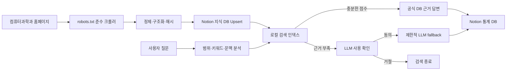

# ComPass

**ComPass = Computer + Compass(나침반)**

한국방송통신대학교 컴퓨터과학과 학생들의 길잡이가 되는 공식 정보 RAG 챗봇입니다. 홈페이지 공개 정보를 수집해 Notion 지식 DB에 적재하고 공식 데이터 검색을 우선합니다.

## 주요 기능

- `https://cs.knou.ac.kr/sites/cs1/index.do`에서 시작하는 내부 링크 BFS 크롤링
- `cs.knou.ac.kr/sites/cs1` 하위 공개 HTML만 수집
- robots.txt 준수, 요청 간 delay, 중복 URL 제거, 로그인·외부 링크 제외
- 제목, 카테고리, 본문, 요약, 원본 URL, 게시일, 수집일, 키워드, 첨부파일 구조화
- URL 기준 Notion upsert 및 콘텐츠 해시 기반 `신규/변경/유지` 판정
- 유사어 확장, 키워드 빈도, 제목·카테고리 가중치, 부분 일치 기반 로컬 검색
- Notion 공식 데이터 검색 결과 우선 답변
- 검색 점수가 낮을 때 사용자 확인 후 OpenAI 또는 Gemini 보조 호출
- 이전 질문을 이용한 짧은 후속 질문 문맥 보완
- 모든 질문·응답을 Notion 통계 DB에 비동기 기록
- 크롤링, 인덱스, 검색 테스트, 질문 통계를 포함한 한국어 관리자 UI
- Depth 0~5 수동 크롤링 범위 선택과 실시간 방문·대기·수집 현황 프로그래스바
- Render 콜드 스타트 안내 화면 및 모바일 반응형 UI
- 빈 화면 우측 하단 플로팅 아이콘, 채팅 창 모드, 전체 화면 전환

## 프로젝트 구조

```text
.
├── main.py                 # FastAPI 앱과 API
├── config.py               # 환경변수 및 공통 설정
├── crawler.py              # 홈페이지 크롤러
├── notion_client.py        # Notion 조회/upsert 클라이언트
├── search_index.py         # 로컬 검색 인덱스
├── chatbot.py              # 범위 제한, DB 우선 답변, LLM fallback
├── stats.py                # Notion 질문 통계 저장/조회
├── templates/index.html    # 단일 관리자/챗봇 화면
├── static/style.css
├── static/app.js
├── data/                   # 크롤링 스냅샷과 검색 인덱스
├── requirements.txt
├── .env.example
└── render.yaml
```

## 처리 흐름



## 로컬 실행

Python 3.11 이상을 권장합니다.

```bash
python3 -m venv .venv
source .venv/bin/activate
pip install -r requirements.txt
cp .env.example .env
```

`.env`에 Notion 토큰, DB ID, 관리자 비밀번호, 사용할 LLM API 키를 입력합니다.

```bash
uvicorn main:app --reload --host 127.0.0.1 --port 8000
```

브라우저에서 `http://127.0.0.1:8000`을 엽니다. 최초 실행 순서는 다음과 같습니다.

1. `크롤링 관리`에서 관리자 비밀번호를 입력합니다.
2. `DB 테이블 구성`을 눌러 빈 Notion DB에 필수 컬럼을 자동 생성합니다.
3. `수동 크롤링 실행`으로 홈페이지를 수집하고 Notion에 적재합니다.
4. `검색 인덱스`에서 `인덱스 재생성`을 실행합니다.
5. 검색 테스트 후 챗봇 탭에서 질문합니다.

## 환경변수

| 변수 | 설명 |
|---|---|
| `NOTION_TOKEN` | Notion Internal Integration Secret |
| `NOTION_KNOWLEDGE_DB_ID` | 크롤링 지식 DB ID |
| `NOTION_STATS_DB_ID` | 질문 통계 DB ID |
| `LLM_PROVIDER` | `openai` 또는 `gemini` |
| `OPENAI_API_KEY` | OpenAI 사용 시 API 키 |
| `OPENAI_MODEL` | OpenAI 모델명 |
| `GEMINI_API_KEY` | Gemini 사용 시 API 키 |
| `GEMINI_MODEL` | Gemini 모델명 |
| `CRAWL_START_URL` | 크롤링 시작 URL |
| `ALLOWED_DOMAIN` | 허용 호스트 |
| `ALLOWED_PATH_PREFIX` | 허용 URL 경로 접두사. 쉼표로 복수 지정 가능 |
| `CRAWL_DELAY_SECONDS` | 요청 사이 대기 시간 |
| `CRAWL_MAX_PAGES` | 한 번에 방문할 최대 URL 수 |
| `ADMIN_PASSWORD` | 관리자 API 비밀번호 |
| `SEARCH_MIN_SCORE` | DB 답변으로 인정할 최소 검색 점수 |

토큰과 키는 코드에 넣지 말고 `.env` 또는 배포 서비스의 Secret 환경변수로만 관리합니다.

## Notion 연동 준비

1. Notion에서 Internal Integration을 생성합니다.
2. 지식 DB와 통계 DB 각각의 연결 메뉴에서 해당 Integration을 초대합니다.
3. `.env`에 Integration Secret과 DB ID를 입력합니다.
4. 아래 표와 **동일한 한글 컬럼명 및 타입**으로 DB를 구성합니다.

### 지식 DB 컬럼

| 컬럼명 | Notion 타입 | 비고 |
|---|---|---|
| 제목 | Title | 필수 |
| 카테고리 | Select | |
| 본문 | Rich text | 검색용 본문 앞부분, 전체 본문은 페이지 블록에도 저장 |
| 요약 | Rich text | |
| 원본URL | URL | 중복 판정 키 |
| 게시일 | Date | |
| 수집일 | Date | |
| 키워드 | Multi-select | |
| 콘텐츠해시 | Rich text | 변경 판정 |
| 상태 | Select | 신규 / 변경 / 유지 |
| 검색용텍스트 | Rich text | 제목·카테고리·요약·키워드·본문 결합 |

### 통계 DB 컬럼

| 컬럼명 | Notion 타입 |
|---|---|
| 사용자질문 | Title |
| 질문일시 | Date |
| 추출키워드 | Multi-select |
| 검색결과유무 | Checkbox |
| 응답방식 | Select |
| 답변내용 | Rich text |
| 참조URL | Rich text |
| 응답시간 | Number |
| 검색점수 | Number |
| 실패사유 | Rich text |

Notion DB 링크에서 32자리 ID를 가져와 환경변수에 입력합니다. 제공된 기본 ID는 다음과 같습니다.

- 지식 DB: `38773fbd195180788faac9a54ae8e512`
- 통계 DB: `38773fbd195180708158dc38ec3fbd2f`

## API

| Method | Path | 설명 |
|---|---|---|
| GET | `/` | 메인 HTML |
| POST | `/api/crawl` | `max_depth`를 지정한 수동 크롤링 및 Notion 적재 |
| GET | `/api/crawl/status` | 크롤링 작업 상태 |
| POST | `/api/notion/setup` | 두 Notion DB의 필수 컬럼 자동 구성 |
| POST | `/api/index/rebuild` | Notion 기반 검색 인덱스 재생성 |
| GET | `/api/index/status` | 인덱스 상태 |
| POST | `/api/search/test` | 관리자 검색 테스트 |
| POST | `/api/chat` | DB 검색 우선 질문 처리 |
| GET | `/api/stats` | 최근 질문 통계 |
| GET | `/api/knowledge/recent` | 최근 지식 데이터 |
| GET | `/api/health` | 서버 상태 |

관리자 API에는 `X-Admin-Password` 헤더가 필요합니다.

### 챗봇 요청 예시

```json
{
  "question": "컴퓨터과학과 교육과정을 알려줘",
  "history": [],
  "allow_llm": false
}
```

검색 결과가 부족하면 `requires_llm_confirmation: true`가 반환됩니다. 사용자가 동의한 경우 동일 질문을 `allow_llm: true`로 다시 요청합니다.

### 깊이별 크롤링

```json
{
  "max_depth": 3
}
```

- Depth 0: 시작 페이지
- Depth 1: 주요 메뉴
- Depth 2: 하위 메뉴와 게시판 목록
- Depth 3: 게시물 상세 페이지까지 권장 탐색
- Depth 5: 확장 탐색

## 답변 안전 정책

- 한국방송통신대학교 컴퓨터과학과 공식 정보만 답변합니다.
- 일반 잡담, 타 학교, 타 학과, 개인 상담, 코딩 대행은 거절합니다.
- DB 검색 결과가 있으면 LLM을 호출하지 않습니다.
- 공식 데이터에서 확인되지 않는 내용은 추측하지 않습니다.
- LLM은 공식 정보 범위 안의 질문이며 DB 근거가 부족하고 사용자가 동의한 경우에만 호출합니다.
- 확인되지 않는 경우 다음 문구를 반환합니다.

> 죄송합니다. 해당 내용은 한국방송통신대학교 컴퓨터과학과 공식 데이터에서 확인되지 않습니다. 컴퓨터과학과 홈페이지에 등록된 공식 정보 기준으로만 안내할 수 있습니다.

## Render 배포

1. 프로젝트를 GitHub 저장소에 push합니다.
2. Render에서 `New +` → `Blueprint`를 선택하고 저장소를 연결합니다.
3. `render.yaml` 설정을 확인합니다.
4. Render 대시보드에서 다음 Secret 환경변수를 입력합니다.
   - `NOTION_TOKEN`
   - `NOTION_KNOWLEDGE_DB_ID`
   - `NOTION_STATS_DB_ID`
   - `ADMIN_PASSWORD`
   - `OPENAI_API_KEY` 또는 `GEMINI_API_KEY`
5. 배포 후 `/api/health`가 `ok: true`를 반환하는지 확인합니다.
6. 관리자 UI에서 크롤링과 인덱스 재생성을 순서대로 실행합니다.

Render 무료 인스턴스의 파일시스템은 재배포 시 초기화될 수 있습니다. 따라서 재배포 후 검색 인덱스를 다시 생성해야 합니다. 운영 안정성이 필요하면 인덱스 JSON을 영구 디스크 또는 외부 저장소에 보관하십시오.

### GitHub Pages 콜드 스타트 진입점

사용자에게는 Render URL 대신 아래 GitHub Pages URL을 제공합니다.

```text
https://mhjang-qa.github.io/ComPass/
```

GitHub Pages 정적 화면은 즉시 컴퓨터과학과 메인 배경과 로딩 상태를 표시하고 Render의 `/api/health`를 호출합니다. Render가 준비되면 실제 ComPass 화면을 자동으로 불러옵니다. 저장소 Settings → Pages의 Source는 `GitHub Actions`로 설정합니다.

## 테스트 질문 예시

- 컴퓨터과학과 교육목표를 알려줘.
- 교수진 정보를 알려줘.
- 학과 사무실 연락처는 어디에서 확인해?
- 컴퓨터과학과 교과과정을 알려줘.
- 최근 공지사항을 알려줘.
- 학과 일정은 어디서 확인할 수 있어?
- 자주 묻는 질문 중 수강 관련 내용을 찾아줘.
- 그 일정은 언제야? *(이전 대화 문맥 테스트)*
- 오늘 날씨 알려줘. *(범위 외 질문 테스트)*
- 파이썬 과제를 대신 작성해줘. *(코딩 대행 거절 테스트)*


## 운영 시 주의사항

- 대상 사이트의 robots.txt와 이용 정책이 변경될 수 있으므로 정기적으로 확인하십시오.
- `CRAWL_DELAY_SECONDS`를 과도하게 낮추지 마십시오.
- 공개 페이지라도 개인정보가 포함된 게시물은 별도 필터 정책을 검토하십시오.
- Notion API의 Rich text 길이 제한 때문에 속성에는 앞부분을 넣고, 신규 페이지의 전체 본문은 블록으로 분할 저장합니다.
- LLM 모델명과 API 사양은 공급자 정책에 따라 변경될 수 있으므로 배포 시 유효한 모델을 환경변수로 지정하십시오.
